# 分支测试
### 1.分支创建
> 新建分支，在历史提交中，右键 `create new brance`
>> 
> 创建成功历史截图
>> 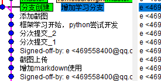
### 2.切换分支
> 回到git的主页面，brance => checkout => 分支创建 => checkout
>> 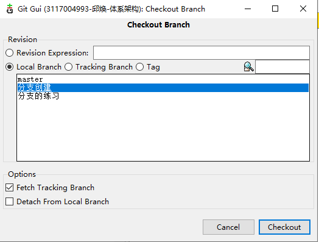
> 切换后历史截图
>> 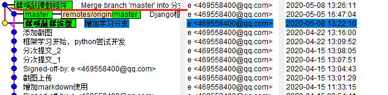
### 3.合并分支
> git主页面，merge => local Merge => merge
>> 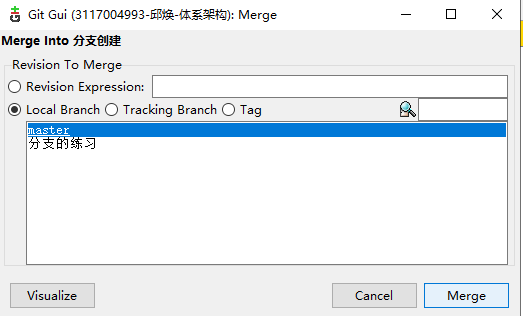
> 合并结果
>> 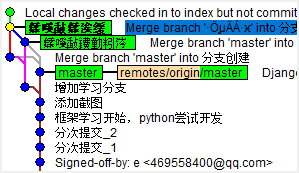

# 冲突处理
### 分支一操作
> 1.在“分支创建”分支创建新文件new.txt， 写下“分支一的新建”，修改两个分支都有的文件branch.txt
> 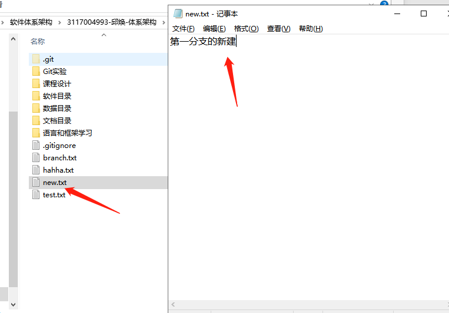
> 2.git gui里提交
### 分支二操作
> 1.切换到分支“分支的练习”，同样新建new.txt，修改branch.txt
> 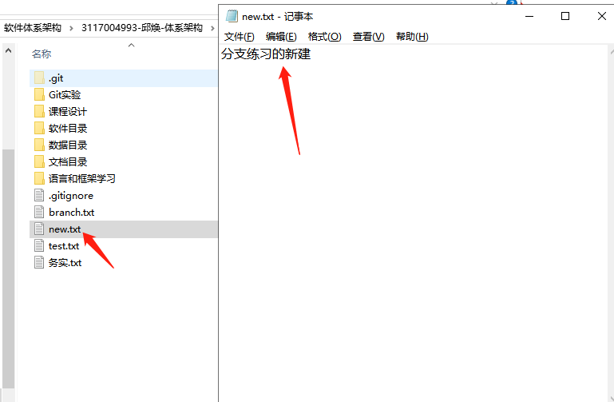 
> 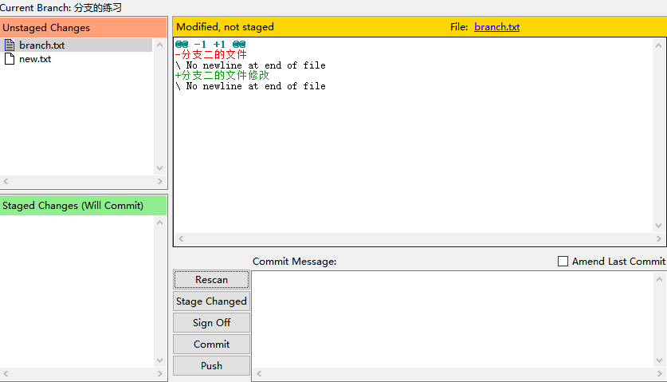 
### 合并
> 1.切换到master
> 2.将“分支创建”合并进来，一切正常
> 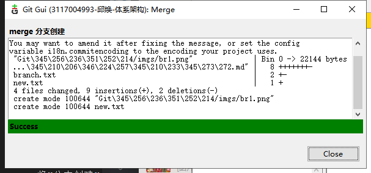
> 3.合并“分支练习”，出现冲突
> 
> 冲突的内容：
>> 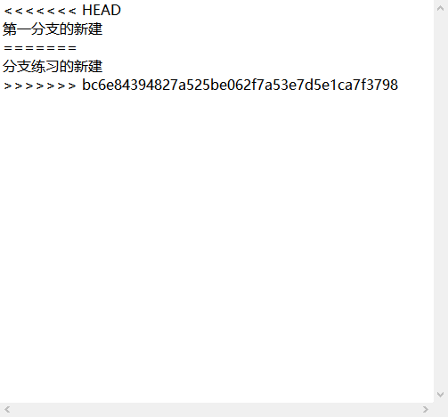
### 处理冲突
> 一共出现了两个冲突，一个是new.txt的冲突，另一个是branch.txt的冲突。
> 处理方法：在gui界面右键，其中会有两个选项：`use local version`和`use remote version`，第一个表示使用本地版本，即保留目前master的版本，即抛弃新合并分支里的内容；第二个是使用新加进来的分支版本。
> 例如：new.txt选择了`use local version`
>>  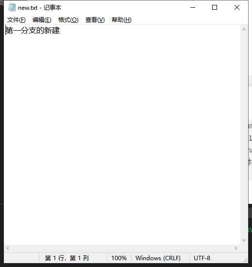