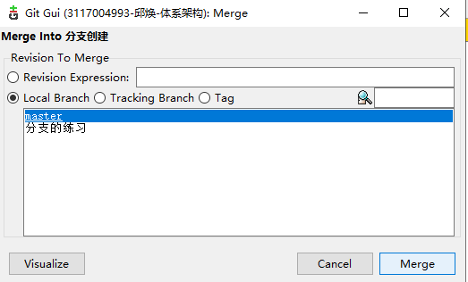
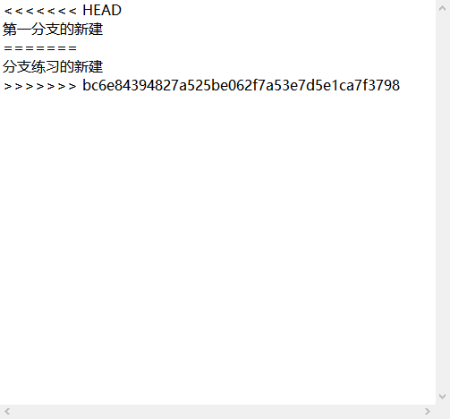

# 分支测试
### 1.分支创建
> 新建分支，在历史提交中，右键 `create new brance`
>> 
> 创建成功历史截图
>> 
### 2.切换分支
> 回到git的主页面，brance => checkout => 分支创建 => checkout
>> 
> 切换后历史截图
>> 
### 3.合并分支
> git主页面，merge => local Merge => merge
>> 
> 合并结果
>> 

# 冲突处理
### 分支一操作
> 1.在“分支创建”分支创建新文件new.txt， 写下“分支一的新建”，修改两个分支都有的文件branch.txt
> 
> 2.git gui里提交
### 分支二操作
> 1.切换到分支“分支的练习”，同样新建new.txt，修改branch.txt
>  
>  
### 合并
> 1.切换到master
> 2.将“分支创建”合并进来，一切正常
> 
> 3.合并“分支练习”，出现冲突
> 
> 冲突的内容：
>> 
### 处理冲突
> 一共出现了两个冲突，一个是new.txt的冲突，另一个是branch.txt的冲突。
> 处理方法：在gui界面右键，其中会有两个选项：`use local version`和`use remote version`，第一个表示使用本地版本，即保留目前master的版本，即抛弃新合并分支里的内容；第二个是使用新加进来的分支版本。
> 例如：new.txt选择了`use local version`
>>  

# git的松散文件压缩
> Repository->Database statistics
> `number of loose objects`这个是每次git增加文件或者增加提交会增加的文件
>> 
> 点击`Compress Database`就可以压缩文件
> 

# git历史页面操作
> SHA1 ID是每次历史提交的id，截图中的“分支一”是提交的信息，回车可查询到该历史
> 

# XML(eclipse上git的操作)
### Eclipse的git界面
1. `file -> Switch Workspace`修改工作区间为你的项目（含有.git文件夹，eclipse才会识别）
2. `file -> new -> prjecct -> General -> Project -> finish`创建eclipse项目
> 
3. 通过菜单 Windows 。Show view 选择 git
> 
> 
4. 在仓库那里右键，打开commit，这里的git操作跟GUI差不多
> 

### xml文件
1. 右键新建文件，选择xml文件创建
>    
2. 修改命名空间，可以直接在source里手动修改
3. 增加命名空间前缀，在Design页，右键一个元素，选择修改namespace，Prefix就是前缀
> 
> 前缀：my
4. 新增命名空间，同样右键元素，选择修改，然后add一个新的
> 
> 可以看到有两个xmlns

### xml框架检验
1. 右键，`new -> other -> xml -> schema`(dtd也是写检验的文件，但太老了)
> 
2. 修改自动生成的schema文件的namespace为想要校验格式的xml文件的命名空间
3. 在element区域右键新增元素把想要检验的元素加进去
> 