# 分支测试
### 1.分支创建
> 新建分支，在历史提交中，右键 `create new brance`
>> 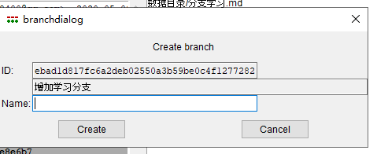
> 创建成功历史截图
>> 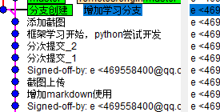
### 2.切换分支
> 回到git的主页面，brance => checkout => 分支创建 => checkout
>> 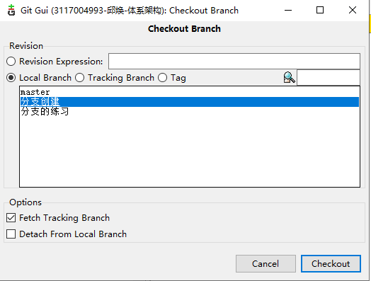
> 切换后历史截图
>> 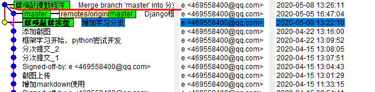
### 3.合并分支
> git主页面，merge => local Merge => merge
>> 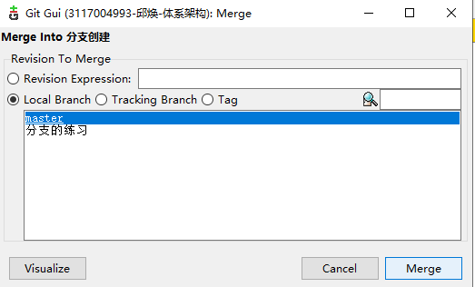
> 合并结果
>> 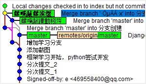

# 冲突处理
### 分支一操作
> 1.在“分支创建”分支创建新文件new.txt， 写下“分支一的新建”，修改两个分支都有的文件branch.txt
> 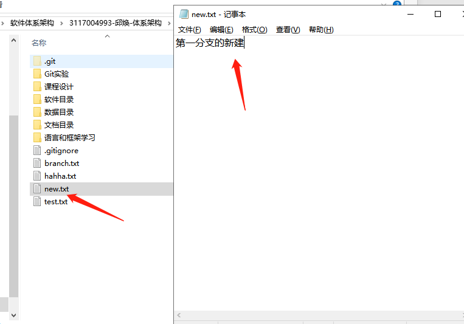
> 2.git gui里提交
### 分支二操作
> 1.切换到分支“分支的练习”，同样新建new.txt，修改branch.txt
> 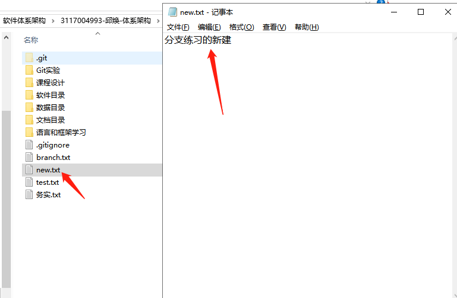 
> 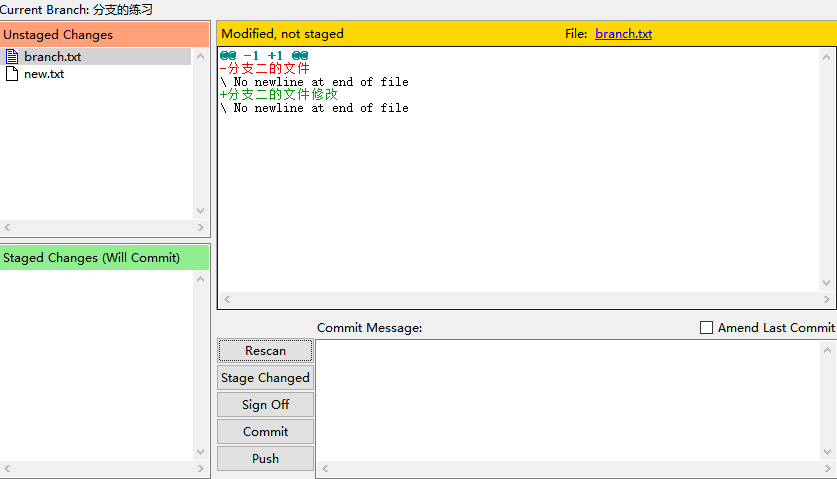 
### 合并
> 1.切换到master
> 2.将“分支创建”合并进来，一切正常
> 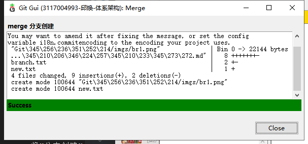
> 3.合并“分支练习”，出现冲突
> 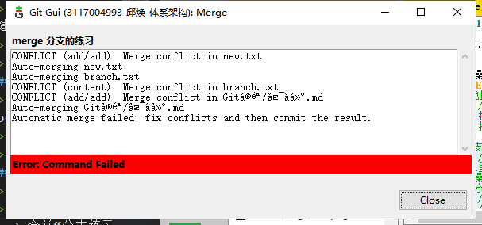
> 冲突的内容：
>
> > 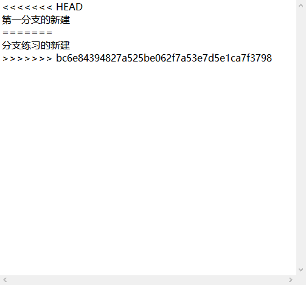
### 处理冲突
> 一共出现了两个冲突，一个是new.txt的冲突，另一个是branch.txt的冲突。
> 处理方法：在gui界面右键，其中会有两个选项：`use local version`和`use remote version`，第一个表示使用本地版本，即保留目前master的版本，即抛弃新合并分支里的内容；第二个是使用新加进来的分支版本。
> 例如：new.txt选择了`use local version`
>
> >  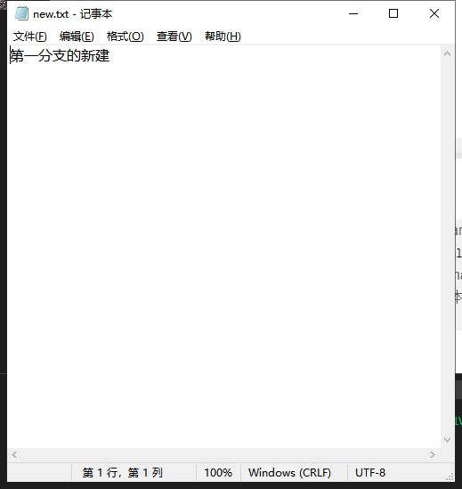

# git的松散文件压缩
> Repository->Database statistics
> `number of loose objects`这个是每次git增加文件或者增加提交会增加的文件
>> 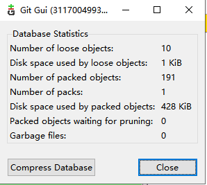
> 点击`Compress Database`就可以压缩文件
> 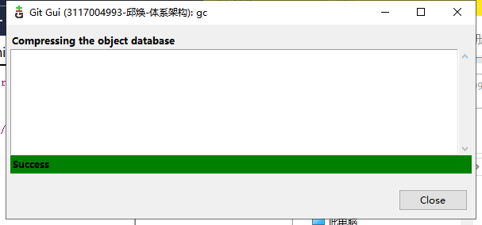

# git历史页面操作
> SHA1 ID是每次历史提交的id，截图中的“分支一”是提交的信息，回车可查询到该历史
> 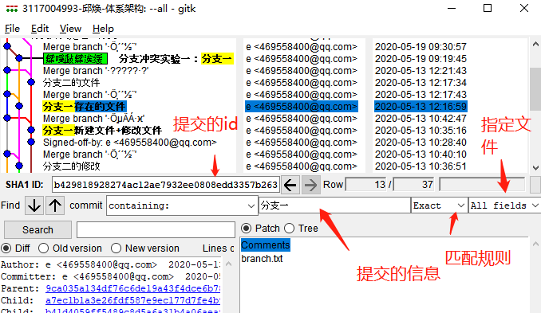

# XML(eclipse上git的操作)
### Eclipse的git界面
1. `file -> Switch Workspace`修改工作区间为你的项目（含有.git文件夹，eclipse才会识别）
2. `file -> new -> prjecct -> General -> Project -> finish`创建eclipse项目
> 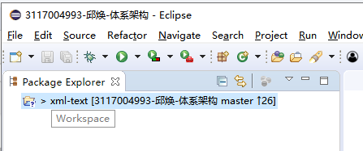
3. 通过菜单 Windows 。Show view 选择 git
> 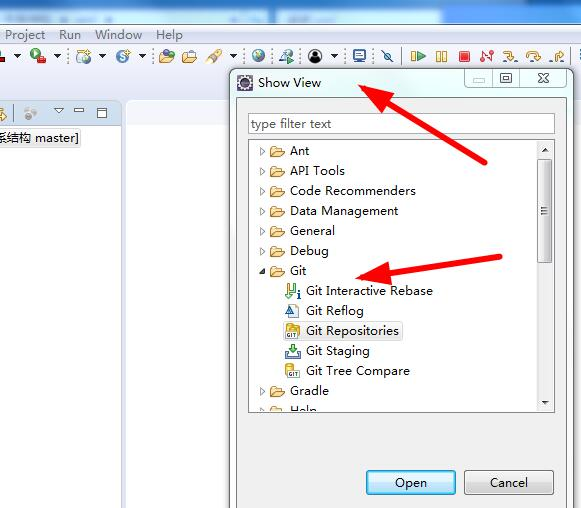
> 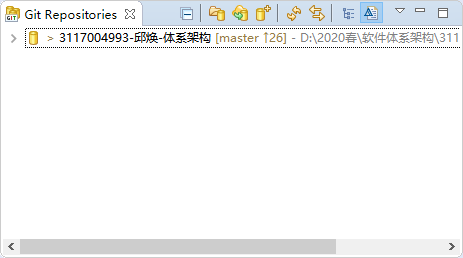
4. 在仓库那里右键，打开commit，这里的git操作跟GUI差不多
> 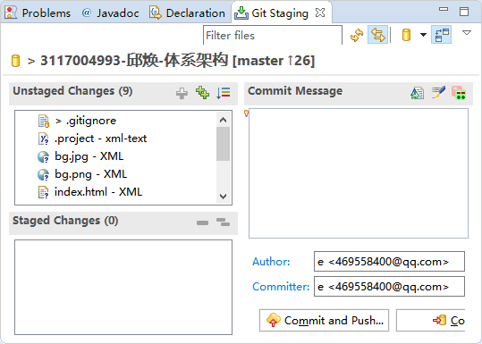

### xml文件
1. 右键新建文件，选择xml文件创建
> 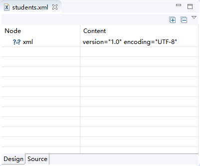   
2. 修改命名空间，可以直接在source里手动修改
3. 增加命名空间前缀，在Design页，右键一个元素，选择修改namespace，Prefix就是前缀
> 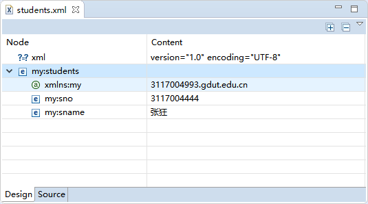
> 前缀：my
4. 新增命名空间，同样右键元素，选择修改，然后add一个新的
> 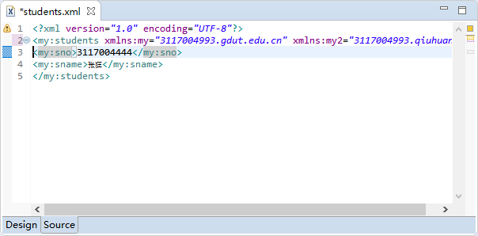
> 可以看到有两个xmlns

### xml框架检验
1. 右键，`new -> other -> xml -> schema`(dtd也是写检验的文件，但太老了)
> 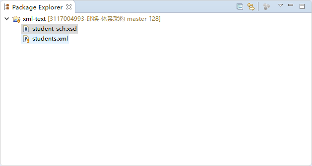
2. 修改自动生成的schema文件的namespace为想要校验格式的xml文件的命名空间
3. 在element区域右键新增元素把想要检验的元素加进去
> 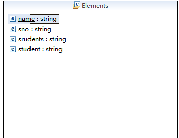
4. 修改命名空间, 在xsd文件的design界面, 右键-`References`-`workspace`, 打开命名空间操作窗口
> 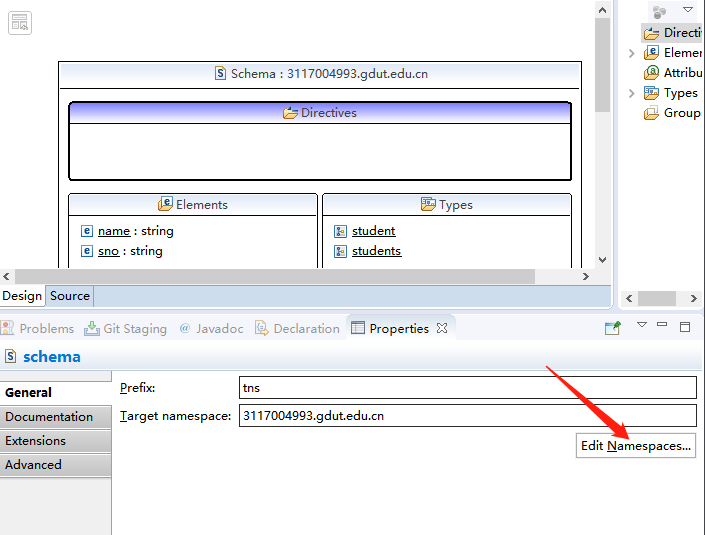
> 点击Edit可以增加、删除、修改命名空间

### xml文件与xsd文档的关联
1. xml里的元素加上`xsi:schemaLocation="命名空间 xsd文档名.xsd"`, 注意这里的命名空间, xml文件与xsd文档中的命名空间要一致
> 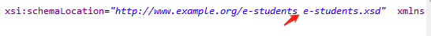

### 继承与组合的优缺点

> 继承
>
> > 继承是Is a 的关系，比如说Student继承Person,则说明Student is a Person。继承的优点是子类可以重写父类的方法来方便地实现对父类的扩展。

　　继承的缺点有以下几点：

　　①：父类的内部细节对子类是可见的。

　　②：子类从父类继承的方法在编译时就确定下来了，所以无法在运行期间改变从父类继承的方法的行为。

　　③：如果对父类的方法做了修改的话（比如增加了一个参数），则子类的方法必须做出相应的修改。所以说子类与父类是一种高耦合，违背了面向对象思想。

> 组合
>
> > 组合也就是设计类的时候把要组合的类的对象加入到该类中作为自己的成员变量。
> > 组合的优点：

　　①：当前对象只能通过所包含的那个对象去调用其方法，所以所包含的对象的内部细节对当前对象时不可见的。

　　②：当前对象与包含的对象是一个低耦合关系，如果修改包含对象的类中代码不需要修改当前对象类的代码。

　　③：当前对象可以在运行时动态的绑定所包含的对象。可以通过set方法给所包含对象赋值。

　　组合的缺点：①：容易产生过多的对象。②：为了能组合多个对象，必须仔细对接口进行定义。

#### 对比

组合比继承更具灵活性和稳定性，所以在设计的时候优先使用组合。只有当下列条件满足时才考虑使用继承：

子类是一种特殊的类型，而不只是父类的一个角色
子类的实例不需要变成另一个类的对象
子类扩展，而不是覆盖或者使父类的功能失效

### 系统中需要有一个唯一的可全局访问对象，我们该如何编程实现？理由

> 实现思路是这样的：
> 1.让该类的构造函数定义为私有（private），这样其它代码没办法去实例化（new）这个对象
> 2.让该类提供一个静态的方法，且让这个静态方法可以得到这个类的实例。
> (```)
> /**

 * Created by wistbean on 2017/9/27.

 * 单例模式 以内部类的形式实现
   */
   public class IodhiSigleton {

   private IodhiSigleton(){}

   private static class LazyHolder
   {
       private final static IodhiSigleton INSTANCE = new IodhiSigleton();
   }

   public static IodhiSigleton getInstance()
   {
       return LazyHolder.INSTANCE;
   }

}
(```)

### 关于json

1. 在项目中用的最多的`JSON.stringfy()`将传入的对象, 数组等转化为json字符串, `JSON.parse()`将传入的json字符串反序列化为对象等。微服务用的就是json格式来传消息。
2. JSON是`JavaScript Object Notation`的缩写，它是一种数据交换格式。

在JSON出现之前，大家一直用XML来传递数据。因为XML是一种纯文本格式，所以它适合在网络上交换数据。XML本身不算复杂，但是，加上DTD、XSD、XPath、XSLT等一大堆复杂的规范以后，任何正常的软件开发人员碰到XML都会感觉头大了，最后大家发现，即使你努力钻研几个月，也未必搞得清楚XML的规范。

终于，在2002年的一天，道格拉斯·克罗克福特（Douglas Crockford）同学为了拯救深陷水深火热同时又被某几个巨型软件企业长期愚弄的软件工程师，发明了JSON这种超轻量级的数据交换格式。

道格拉斯同学长期担任雅虎的高级架构师，自然钟情于`JavaScript`。他设计的`JSON`实际上是`JavaScript`的一个子集。在`JSON`中，一共就这么几种数据类型：

`number`：和`JavaScript`的`number`完全一致；
`boolean`：就是`JavaScript`的`true`或`false`；
`string`：就是`JavaScript`的`string`；
`null`：就是`JavaScript`的`null`；
`array`：就是`JavaScript`的`Array`表示方式——`[]`；
`object`：就是`JavaScript`的`{ ... }`表示方式。
以及上面的任意组合。

并且，`JSON`还定死了字符集必须是`UTF-8`，表示多语言就没有问题了。为了统一解析，JSON的字符串规定必须用双引号`""`，`Object`的键也必须用双引号`""`。


### JSP练习
1. 在Eclipse中创建一个Dynamic Web Project:
“File”->”New”->”Other…”;
“Web”-> “Dynamic Web Project”-> 点击”Next”;
输入项目名 -> 选择项目路径-> 在“Dynamic web module version”中选择Servlet 3.1规范。-> 点击 “Finish”
结果如下：
> 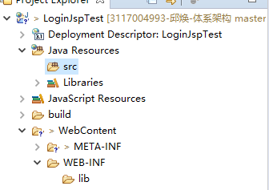
2. 在webContent文件夹下创建`index.jsp`文件
3. 在eclipse下方的输出窗口，`server`->添加tomcat, 然后再弹出的窗口选择tomcat版本，再添加自己本地下载的tomcat。
> 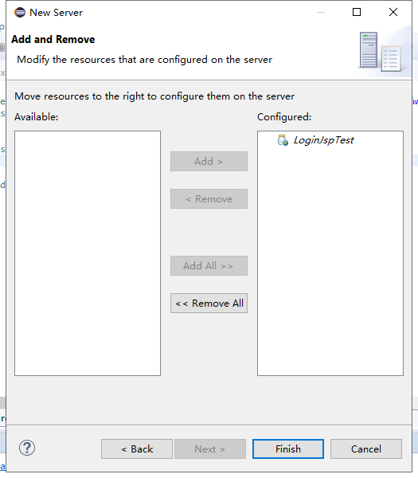
> 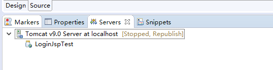
4. 编写login页面的代码
> index页面的encode改成utf-8, 修正乱码
> 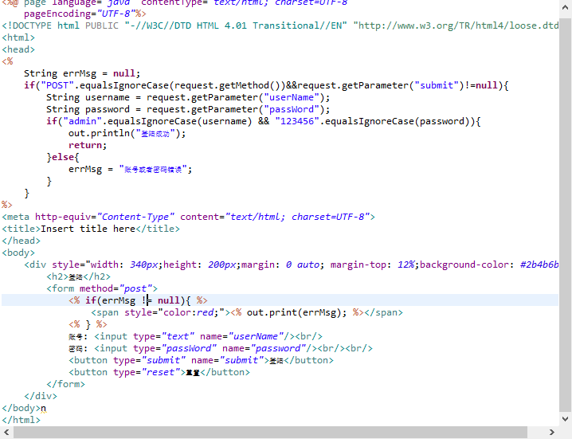
> 页面在浏览器打开效果：
>
> > 