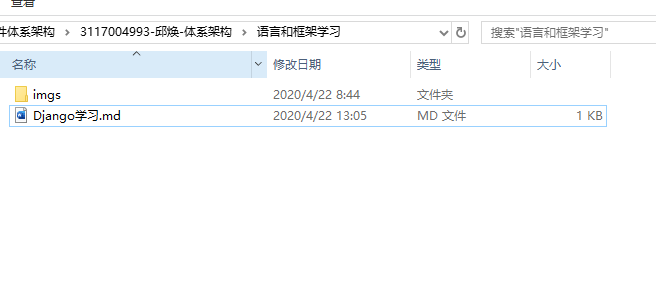
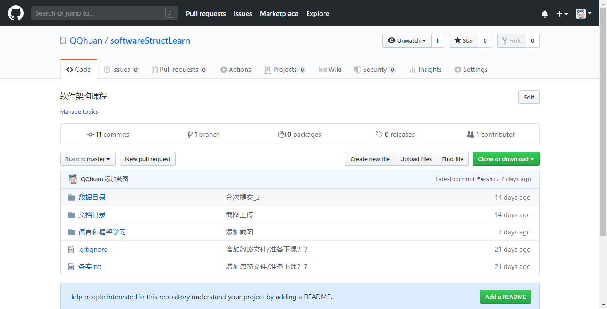
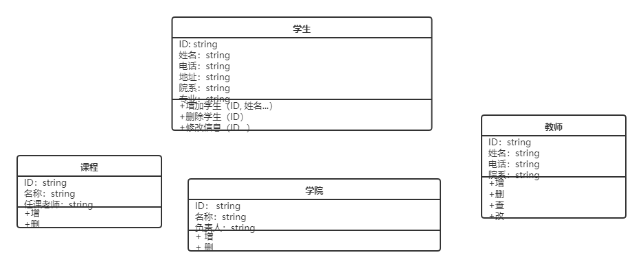

# 1. Django框架学习
## 1.1 截图练习

### 1.2 远程备份
    远程仓库：github
    步骤：1.在github上new一个仓库；2.本地文件夹使用git init，把项目checkout下来

## 1.3 表格练习
|用例编号|01|
|--|--|
|用例名|注册|
|用例描述|用户在注册页面，进行账号注册|
|参与者|普通用户|
|前置条件|系统注册页正常运行|
|后置条件|存储用户信息|
|主事件流||
|备选事件流||

## 1.4 安装Django
### 1.4.1 正在学习
    教程网址 https://www.liaoxuefeng.com/wiki/897692888725344/945674843586112
    
# 2.项目实战
## 1.需求分析
### 1.1 类图

## 2.